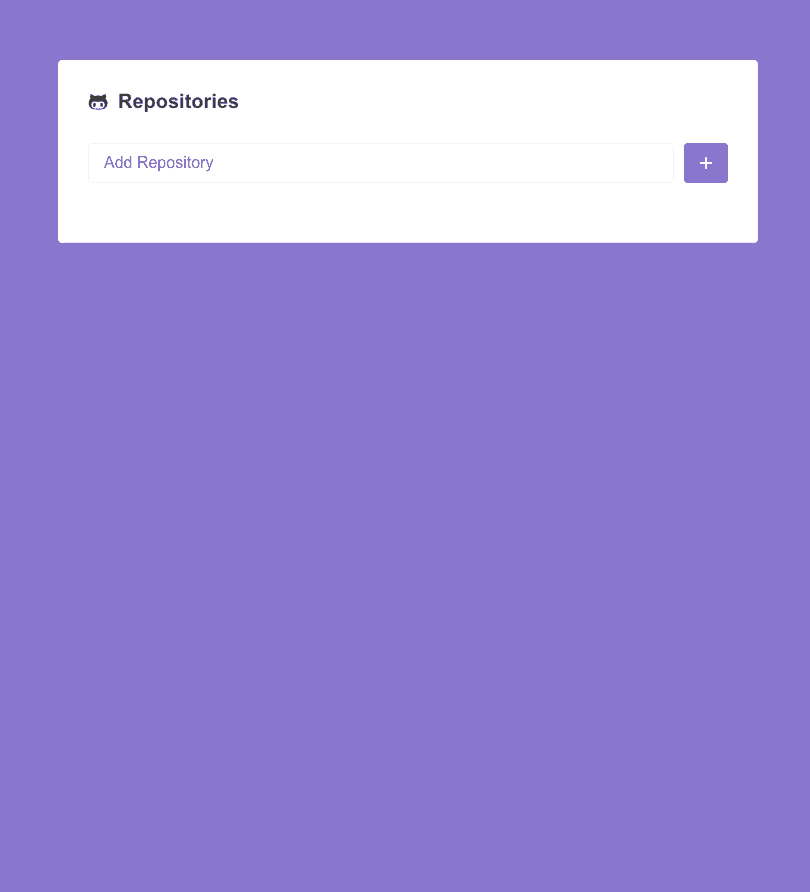

  

    
  

  

## :rocket: About

Quick project using ReactJS and GithubAPI.

Add your favorite Github repositories by typing the repo name. Then click on 'Issues' to check open issues in that repository.

This project was bootstrapped with [Create React App](https://github.com/facebook/create-react-app).

## Scripts

In the project directory, you can run:

### `yarn start`

Runs the app in the development mode. 
Open [http://localhost:3000](http://localhost:3000) to view it in the browser.

The page will reload if you make edits. 
You will also see any lint errors in the console.
